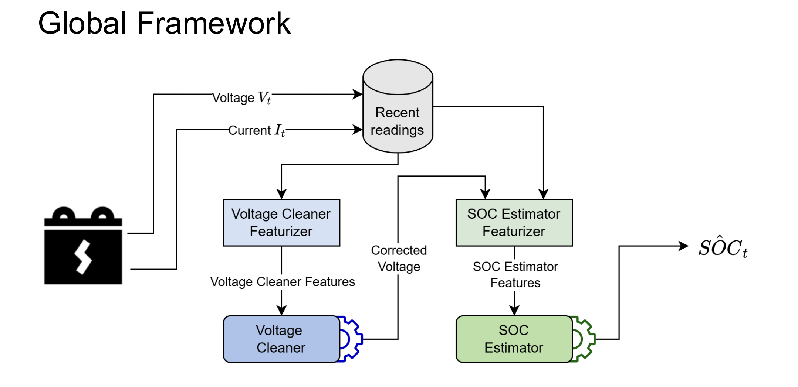
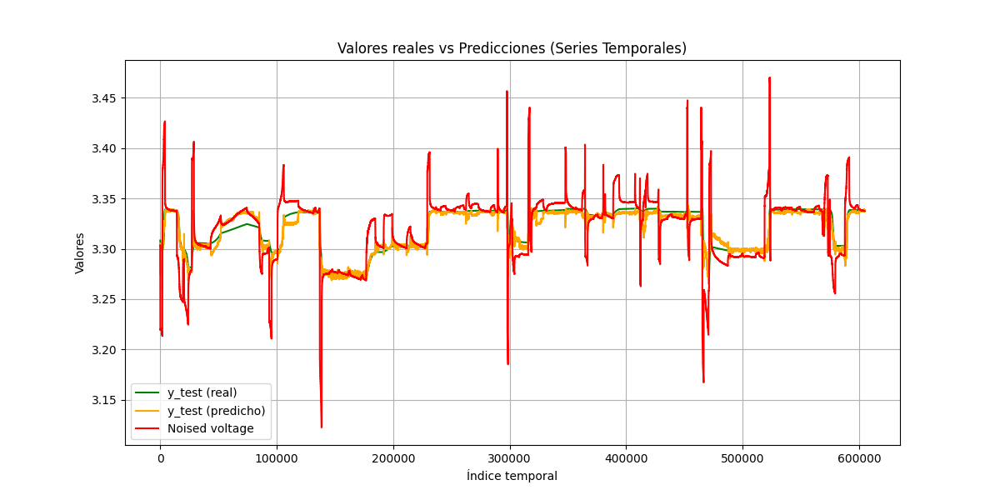
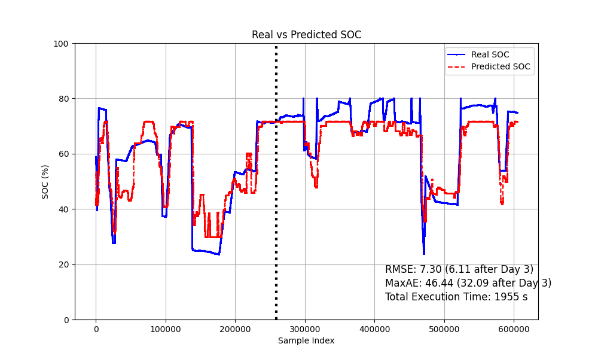
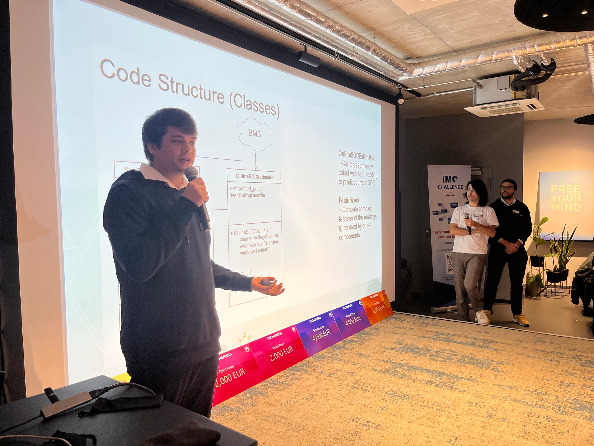

Battery SoC Estimator was a project we built for the Huawei TechArena 2024 hackathon in Nuremberg, together with [Abel](https://www.linkedin.com/in/abel-juncal-su%C3%A1rez-52b86a240/) and [Jorge](https://www.linkedin.com/in/jorge-paz-ruza-646141186).

The challenge was to estimate the State of Charge (SoC) of a lithium battery from sensor measurements. In simple terms, we wanted to predict how much charge was left in the battery from signals such as voltage, current, and temperature.

We ended up building a lightweight two-stage machine learning pipeline and finished **second place** in the competition.

## The problem

Estimating battery SoC is not as simple as reading a single sensor value. Voltage is strongly related to the battery's charge level, but the measured voltage is also affected by factors such as current and temperature.

Our approach was to separate these two problems. First, we learned to estimate a cleaner version of the battery voltage. Then, we used that signal to estimate the actual SoC.

This gave us a non-autoregressive pipeline that could make predictions directly from recent sensor measurements, without having to wait for an iterative estimator to converge.

## How it worked

The system had two stages: first, a Voltage Cleaner estimated a cleaner voltage signal from recent sensor measurements; then, an SoC Estimator used that signal and additional features to predict the battery's State of Charge.

The first model was the **Voltage Cleaner**. It received recent voltage, current, and temperature measurements and learned to estimate what the voltage would look like with the effects of current and temperature reduced.

We then passed the cleaned voltage to the second model, the **SoC Estimator**, together with additional features extracted from the recent sensor history. This model predicted the battery's State of Charge.

For both stages, we used sliding windows over the sensor measurements and extracted statistical features such as mean, minimum, maximum, and standard deviation. The models were tree-based ensembles (such as XGBoost, LightGBM, and CatBoost) trained and tuned offline with cross-validation and Optuna, while keeping the final inference pipeline small enough for real-time use.

One of the main constraints was inference speed. The final system achieved prediction latency below **1 ms** and a model size below **1 MB**, making it suitable for lightweight edge deployments.

## Building it for the competition

The TechArena was not a single weekend hackathon. The competition had several stages, starting with an online phase and eventually leading to an on-site final in Nuremberg.

We had to keep improving the models as we received new data and make sure they continued to work on battery profiles that were not available during training.

The final stage took place at Huawei's headquarters in Nuremberg, where we had to run our solution on new data and present the system alongside the other finalist teams.

## Second place at Huawei TechArena 2024

We made it to the final in Nuremberg and finished second overall. More than anything, I enjoyed working on a problem where the model had to satisfy constraints beyond accuracy: it had to be small, fast, and reliable enough to run in a real-time setting.

For me, it was also a good reminder that a machine learning solution is not finished when the model produces a good number. The way it runs, the data it sees, and the constraints of the system around it matter just as much.

